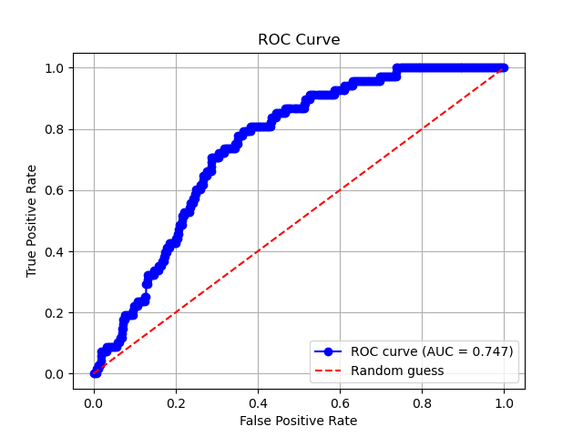

# Validation Workflow

## Table of Contents

- [Introduction](#introduction)
- [Steps of the Validation Workflow](#steps-of-the-valdation-workflow)
  - [BindingDB](#bindingdb)
  - [Split&Rename_IC50.py](#splitrename_ic50py)
  - [Virtual Screening](#virtual-screening)
  - [AUC Determination](#auc-determination)

## Introduction
Docking at its best, is a probabilistic heuristic which gives us a much better chance that the ligands we choose are going to prove to be a hit in the real world than if we were to do it by randomly choosing the ligands for the next stage. By running our docking pipeline for a receptor having a chemical library of known active and inactives derived from in vitro assays, we can get an estimate on how effective the scoring function, choice of hyperparameters, ligand preparation, receptor preparation etc. are at enriching the true actives/positives at the top of our predicted ranked list and to eliminate False Negatives and False Positives.
We do this with the help of a Receiver-Operating Characteristic curve(ROC). The value of the Area Under the ROC curve(AUC score). The AUC score ranges from 0 to 1 and is positively linked with the predictive power of our screening. Where a value of 0.5 means no bettter than random chance, 1 indicative of complete enrichment and 0 showing perfectly negative prediction, most docking workflows have an AUC score ranging from 0.6 to 0.8. 
The reason for choosing the ROC curve for our validation is because AUC values derived from the curve remain more or less unaffected of the ratios of inactives to actives in the testing dataset.

## Steps of the Valdation Workflow
### BindingDB
We want to look for a protein which loosely satisfies the following criteria: 
- Has many experimental data points of `Kd` or `IC50` values for various molecules.
- Has similarity with your essential gene and preferrably has the same source organism.

Beta-lactamase enzymes from Pseudomonas aeruginosa are extensively studied because of their central role in antibiotic resistance. These enzymes hydrolyze the β-lactam ring in antibiotics(particularly penicillin and similar antibiotics), rendering them ineffective, and are a major reason for the clinical challenge posed by P. aeruginosa infections.

The rationale behind choosing this protein is evident - IC50 data pertaining to Beta Lactamase sourced from P. Aeruginosa is available with a large library of molecules. P. Aeruginosa is a pathogen of interest to us and is a member of the ESKAPE group of pathogens.
A single 3D SDF file containing all molecules, their metadata, and IC50 values is available for download.

> IC50 (half maximal inhibitory concentration) is the concentration of a substance required to inhibit a specific biological or biochemical function by 50%. It is commonly used to measure the potency of an inhibitor, such as a drug, against an enzyme, cell, or receptor. To calculate IC50, a series of dose-response experiments are performed, and the data are plotted to generate a curve; the IC50 is determined as the concentration where the response is reduced by half. IC50 values depend on experimental conditions and are typically expressed in molar concentration.

### `Split&Rename_IC50.py`
To further enhance the difference between the actives and inactives, we can selectively choose molecules which are either highly active(IC50\<120 nM) or highly inactive(IC50\>10,000 nM) as per in vitro assays.
`Split&Rename_IC50.py` does that and outputs the selected files as separate molecules. It also names the molecules with the molecule's IC50 value so it is easier to catch False Positives and False Negatives later on.

### Virtual Screening
An example of a virtual screening workflow has been thoroughly described in [Vina_Docking_Protocol](https://github.com/Pratham2405/Vina_Docking_Protocol). After running `Split&Rename_IC50.py`, you shall run your in silico docking workflow. Be sure to get a ranked list of ligands with just two columns - Experimentally derived IC50 values and Predicted Binding Affinity. Export this ranking in a CSV file.

### AUC Determination
In `ROC_Script.py`, enter the path to the ranked CSV as input and run the script. The ROC curve would be plotted via `matplotlib` with the AUC score displayed as shown below:

